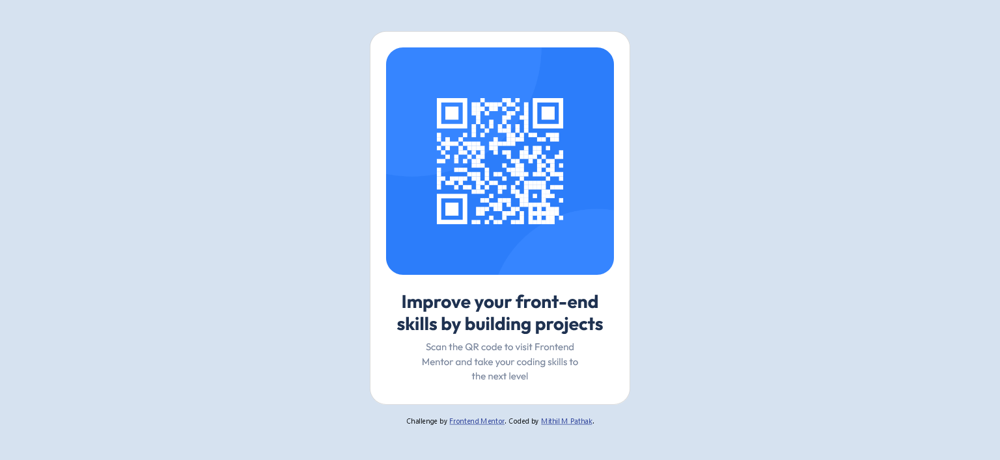

# Frontend Mentor - QR code component solution

This is a solution to the [QR code component challenge on Frontend Mentor](https://www.frontendmentor.io/challenges/qr-code-component-iux_sIO_H). Frontend Mentor challenges help you improve your coding skills by building realistic projects. 

## Table of contents

- [Overview](#overview)
  - [Screenshot](#screenshot)
  - [Links](#links)
- [My process](#my-process)
  - [Built with](#built-with)
  - [What I learned](#what-i-learned)
  - [Continued development](#continued-development)
  - [Useful resources](#useful-resources)
- [Author](#author)
- [Acknowledgments](#acknowledgments)

## Overview

### Screenshot

|  |
|:--:|
| <b>QR Component Screenshot - Desktop View</b>|

|  |
|:--:|
| <b>Qr Component Screenshot - Mobile view</b>|

### Built with
___

- Semantic HTML5 markup
- CSS custom properties
- CSS Grid
- Chrome Developer Tools
- Mobile-first workflow
- [Bootstrap](https://getbootstrap.com/) - For styles and card layout

### Useful resources
___

- [Bootstrap Card Documentation](https://getbootstrap.com/docs/5.2/components/card/#about)

## Author
___

- Website - [Mithil M Pathak](https://www.your-site.com)
- Frontend Mentor - [@Mithil-06](https://www.frontendmentor.io/profile/Mithil-06)